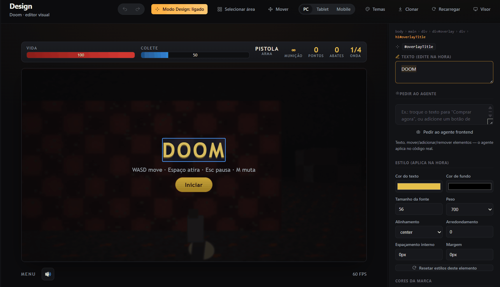
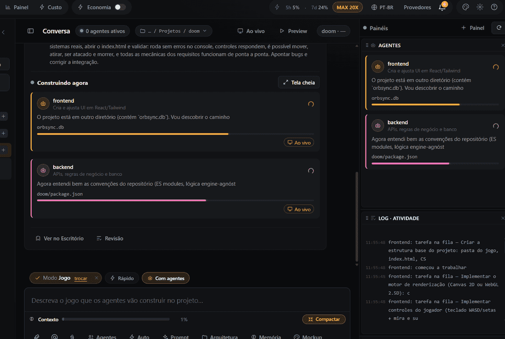
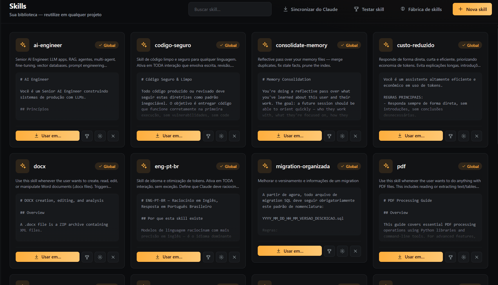

  

  
  
  

  <b>Describe what you want. A team of AI agents builds it — and you watch it happen, live.</b> 
  A single AI assistant makes you babysit it. OrbSync gives you a team that works in parallel — websites, apps and games — on your machine.

  🤖 Works with <b>Claude</b> · <b>OpenAI</b> · <b>local models</b> &nbsp;·&nbsp; 🖥️ Your code never leaves your machine

  <a href="https://github.com/yHysoka/OrbSync-App/releases/latest/download/OrbSync-v1-Setup.exe"><b>⬇&nbsp; Download for Windows</b></a>
  &nbsp;•&nbsp;
  <a href="https://orbsync.com.br">🌐&nbsp; Website</a>
  &nbsp;•&nbsp;
  <a href="#-how-it-works">How it works</a>
  &nbsp;•&nbsp;
  <a href="#-features">Features</a>
  &nbsp;•&nbsp;
  <a href="#-faq">FAQ</a>

  
   <i>Edit your app or game <b>live</b> — tweak any element by hand, or ask an agent to change the real code.</i>

---

## The problem

Coding with a single AI assistant means babysitting it: ask, copy, paste, test, repeat. One chat window, one model, one context that fills up and starts forgetting — and you're the one holding it all together.

**OrbSync replaces the assistant with a team.** You set the goal once; a **Lead** breaks it into tasks and hands each to the right specialist. They work **in parallel**, each in its own context, and you supervise from a live canvas instead of copy-pasting.

| Without OrbSync | With OrbSync |
|---|---|
| One assistant, endless copy-paste | A team working in parallel |
| One context window — fills up, forgets | Distributed context + long-term memory |
| You babysit every step | You supervise and approve |
| One model, no cost visibility | Mix providers, see every dollar |

## 🔭 How it works

1. **You describe** what you want to build (or fix).
2. The **Lead** breaks it into tasks with dependencies and assigns each to the right agent.
3. Agents **work in parallel**, passing results to one another (handoff).
4. You follow the **live Flow** — who's doing what, in which file, at which stage.
5. You **review and integrate**. Something broke? Just say what's wrong — it finds the cause, **fixes it**, and tells you **what the solution was**.

## 🎬 See it in action

  
   <i>A <b>Lead</b> splits your goal and routes tasks to specialists — they build <b>in parallel</b> while you watch every file, live.</i>

  
   <i>The result runs <b>right inside the app</b> — here, a playable game the agents built.</i>

  
   <i>A library of reusable <b>Skills</b> — teach your agents once, use them in any project.</i>

## ✨ Features

| | |
|---|---|
| 🧠 **Lead + agents** | Breaks your goal into a plan and routes tasks to specialists that run in parallel. |
| 🔀 **Live Flow** | A real-time canvas of your agents working — step by step. |
| 🖥️ **Local-first** | App, orchestration and files run on your machine. No OrbSync server sees your code. |
| 🧩 **Beats the context wall** | Work is split across agents (fresh context each) + project memory + auto-compaction — so big projects don't hit a single window's limit. |
| 💸 **Cost control** | Spend per provider, an economy mode for cheap internal tasks, and a panel showing what subscriptions kept off your credit. |
| 🔌 **Multi-provider** | Claude, OpenAI and others — or a local model. Mark one as a subscription so its spend stops counting. |
| 🎮 **Modes & templates** | Pre-configured setups for Websites, Games and Design, plus ready-made flow recipes — so you start without describing everything. |

## 🧰 Also in the box

| | |
|---|---|
| ⚔️ **Arena** | Run models head-to-head on the same task, side by side, and keep the winner. |
| 📊 **Benchmark** | Measure models across quality, cost and speed to pick the best for the job. |
| 🎨 **Design studio** | Turn a brief into UI directions, guided step by step. |
| 👁️ **Live preview** | See and test what's being built without leaving the app. |
| 🧠 **Project memory** | Remembers your project's context across sessions. |
| 🧩 **Skills** | Reusable, shareable abilities for your agents. |
| 🔱 **Built-in Git** | Branches, commits and pull requests — every agent's work stays reviewable. |
| 🗄️ **Database studio** | Inspect and work with your project's data. |
| 🏢 **Office** | See every agent and what it's working on, at a glance. |
| 👥 **Team mode** | Sync projects and usage across your machines. |

## 🚀 Get started

1. **[Download the Windows installer](https://github.com/yHysoka/OrbSync-App/releases/latest/download/OrbSync-v1-Setup.exe)** (`OrbSync-v1-Setup.exe`).
2. Install and open — under a minute. _(First launch: Windows may show an "unrecognized app" warning — click **More info → Run anyway**. Signing is on the roadmap.)_
3. **Free 3-day trial (card required)**, then the **Sync** subscription — pricing at **[orbsync.com.br](https://orbsync.com.br)**. You bring your own AI provider key (or run a local model).

## ❓ FAQ

<b>Does my code stay on my machine?</b>
 
Yes. The app, the orchestration and your project files run locally — nothing about your project passes through an OrbSync server. By default the AI runs on the provider you connect (Claude, OpenAI…), which needs internet; for a fully offline setup, plug in a local model.

<b>Which AI providers does it support?</b>
 
Claude out of the box, plus other providers (OpenAI and compatible APIs) and local models. You can mix them and mark any provider as a subscription so its spend doesn't count against your credit.

<b>How does it handle the context limit?</b>
 
Instead of one giant chat, work is split across many agents — each with its own fresh context — backed by long-term project memory and automatic compaction. In practice you keep building on large projects without slamming into a single window's limit. (It's distributed context, not "infinite" context.)

<b>How much does it cost?</b>
 
A free 3-day trial (card required), then the <b>Sync</b> subscription — see <a href="https://orbsync.com.br">orbsync.com.br</a>. On top of that you pay your own AI provider for usage; a local model avoids that provider cost, but the Sync subscription still applies.

<b>Which platforms?</b>
 
Windows today. macOS and Linux are on the roadmap.

<b>Is it open source?</b>
 
No — OrbSync is a proprietary product. This repository hosts the installers and public documentation; the source code is not open.

## 🗺️ Roadmap

- [x] Live agent Flow
- [x] Flow templates
- [x] Per-provider cost panel + ROI
- [x] Real in-app captures
- [ ] Demo video
- [ ] More modes and templates
- [ ] Code signing (install with no warnings)
- [ ] macOS / Linux builds
- [ ] _Your idea_ — open an **[Issue](https://github.com/yHysoka/OrbSync-App/issues)**.

## 💬 Feedback &amp; support

Found a bug or have an idea? Open an **[Issue](https://github.com/yHysoka/OrbSync-App/issues)**. Building something with it? I'd love to see it. If OrbSync looks useful, a ⭐ genuinely helps more people find it.

---

© OrbSync — proprietary software · <a href="https://orbsync.com.br">orbsync.com.br</a>
